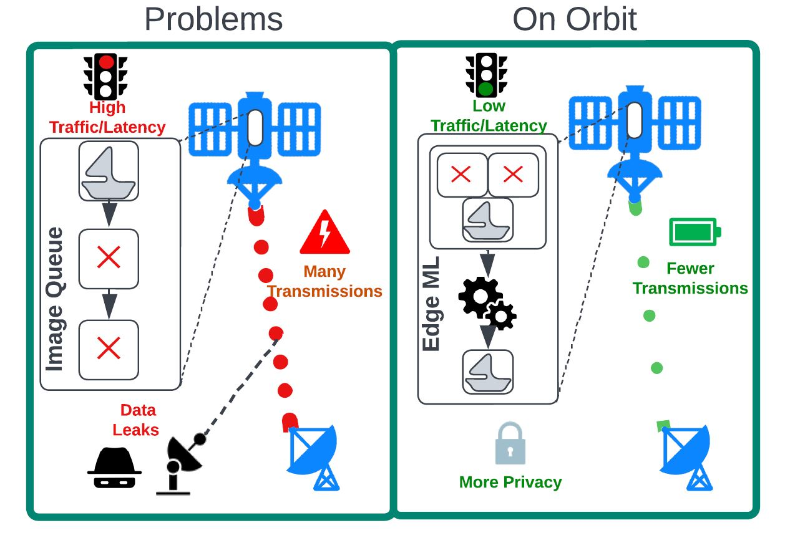

# 🚀 Towards On-Orbit Machine Learning in Picosatellites

This project explores deploying lightweight object detection ML models onboard Picosatellites to minimize data transmission and power consumption by processing data on-orbit.
 
 
<p align="center">
  
</p>
## 📌 Key Features

- ✅ Evaluates Object Detection models on constrained edge devices in the context of a a full deployment for example data reading, model image slicing .
- ✅ Benchmarks **peak power, peak memory, CPU usage, Accelerator usage** across platforms.
- ✅ Supports **quantisation (INT8, FP16)** and hardware acceleration (TPU, GPU, etc.).
- ✅ Tests conducted on Raspberry Pi 3B+, Odroid XU4, Odroid N2+ with full brakedown of OS,Architectures and Software Packages.

---

## 📁 Project Structure

```bash
.
├── models/             # YOLOv5 & YOLOv8 trained models
├── data/               # DIOR dataset preprocessing and conversion
├── scripts/            # Training, quantisation, benchmarking
├── results/            # Logged metrics and plots
├── docs/               # Full technical documentation
├── README.md
└── LICENSE

## 🧪 Benchmark Platforms

The following embedded devices were used to evaluate on-orbit ML performance:

**Raspberry Pi 3B+** — with Coral Edge TPU  
**Odroid N2+** — with ARM Mali-G52 GPU acceleration  
**Odroid XU4** — CPU-only testing

### Metrics Measured

- 🔋 Peak Power (mW)
- 💾 Memory usage (MB)
- ⏱️ Inference and Full Process time (s)
- 🎯 Accuracy (mAP50, Recall)
