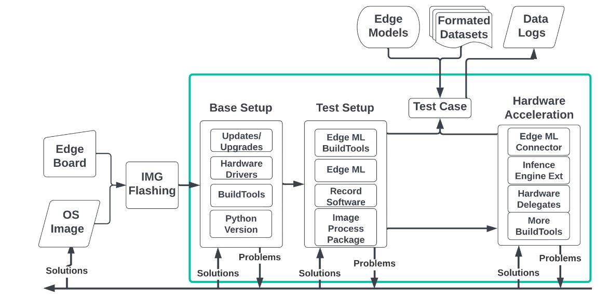
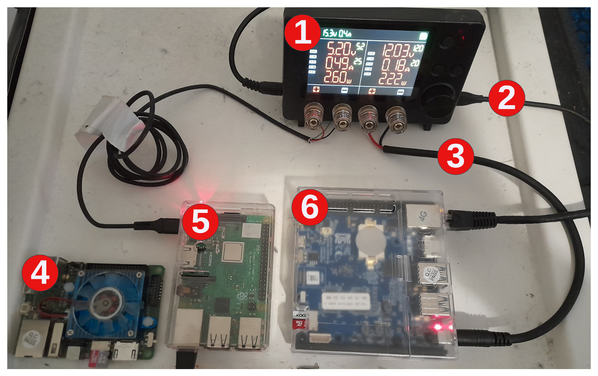

# 🚀 Towards On-Orbit Machine Learning in Picosatellites-WIP

This project explores deploying lightweight object detection ML models onboard Picosatellites to minimize data transmission to reduce power consumption, latency and increase security by processing data on-orbit.
 
 
<p align="center">
  
  <br>
  <b>Figure:</b> Left – challenges with traditional satellite data collection; Right – benefits of On-Orbit processing using edge ML.
</p>
📌 Key Features

- ✅ Evaluates Object Detection models on constrained edge devices in the context of a a full deployment for example data reading, model image slicing .
- ✅ Hardware and Software Optimisation **quantisation (INT8, FP16)** and hardware acceleration (TPU, GPU, etc.).
- ✅ Software for automating the testing process on edge devices, including cv2 image processing and NMS for variety of models and quantisations. 
- ✅ Framework for recording important information, complete breakdown of OS, Architectures and Software Packages.

---

## 📁 Project Structure

```bash
.
├── models/             # YOLOv5 & YOLOv8 trained models
├── data/               # DIOR dataset preprocessing and conversion
├── scripts/            # Training, quantisation, benchmarking
├── results/            # Logged metrics and plots
├── docs/               # Full technical documentation
├── README.md
└── LICENSE
```

## 📁 Setting up edge boards
<p align="center">
  
  <br>
  <b>Figure:</b> How to setup a board
</p>


<p align="center">
  
  <br>
  <b>Figure:</b> How to setup a board
</p>
Each edge board will come up with its own limiitations and constraints, this diagram helps to show how diffrent architectures, packages and languages rely on each other, showing sensible flow of work to bugtest and complete your work
### 🧪 Setup used in this project

<p align="center">
  
  <br>
  <b>Figure:</b> Left – challenges with traditional satellite data collection; Right – benefits of On-Orbit processing using edge ML.
</p>

The following embedded devices were used to evaluate on-orbit ML performance:

**Raspberry Pi 3B+** — with Coral Edge TPU  
**Odroid N2+** — with ARM Mali-G52 GPU acceleration  
**Odroid XU4** — CPU-only testing

### Metrics Measured

- 🔋 Peak Power (mW)
- 💾 Memory usage (MB)
- ⏱️ Inference and Full Process time (s)
- 🎯 Accuracy (mAP50, Recall)
