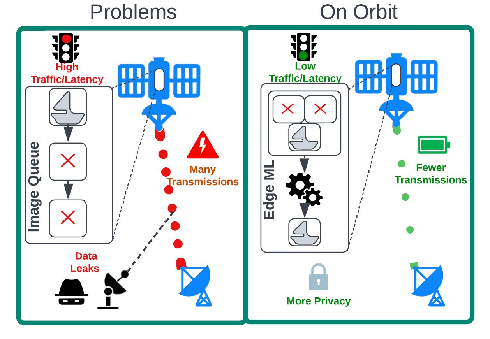

# 🚀 Towards On-Orbit Machine Learning in Picosatellites

The current method of downlinking the data collected by satellites to Earth causes high latency and power consumption and therefore is unsuitable for Picosatellites with limited system resources. On-Orbit Machine Learning (on-orbit ML) offers a solution by decreasing the amount of data to transmit. However, while ML methods exist for use in Picosatellites, they lack suitable recordings of system measurements such as power, memory, and processing time, which hinders their implementation. We address this issue by testing various ML models with compression methods and lightweight architectures on edge setups, using a mix of hardware and software optimisations, while focusing on different processing architectures, accelerators, and delegate improvements. We found that different combinations of models and edge setups for various goals and limitations that Picosatellites can have, providing valuable insights for practical applications. 
 
 
<p align="center">
  
  <br>
  <b>Current Problems with Data Recording on Pico-Satellites:</b> Left – challenges with traditional satellite data collection; Right – benefits of On-Orbit processing using edge ML.
</p>


## What This Project Demonstrates

This project investigated and compared the performance of various YOLOv5 and YOLOv8 object detection models at different sizes, classes, and quantisation, across diverse board setups. These setups included Raspberry Pi 3B+ with and without TPU, Odroid XU4, and Odroid N2+ using the ARM TF-Lite delegate with and without GPU. The study evaluated the models based on power efficiency, peak power, timings, and memory usage, highlighting the strengths and weaknesses of each model and the applied techniques, providing insights for their optimal utilisation in real-world small satellite applications across a range of test setups and Model variations. 

## Tools & Techniques

- **Software Optimization:** Quantization (INT8, FP16), TF-Lite, Linux.
- **Object Detection:** YOLOv5, YOLOv8 lightweight model training.
- **Hardware & Embedded Systems:** Raspberry Pi 3B+, Odroid N2+, Odroid Xu4, Coral Edge TPU.
- **Computer Vision Tools:** OpenCV for preprocessing and image slicing.


### Metrics Measured

- 🔋 Peak and average Power at inference and full process (mW)
- 💾 Real Memory usage at inference and full process (MB)
- ⏱️ Inference and Full Process time (ms)
- 🎯 Accuracy (mAP50)

## 📁 Project Structure

```bash
.
├── models/             # YOLOv5 & YOLOv8 trained models
├── data/               # DIOR dataset preprocessing and conversion
├── scripts/            # Training, quantisation, benchmarking
├── results/            # Logged metrics and plots
├── docs/               # Full technical documentation
├── README.md
└── LICENSE
```
