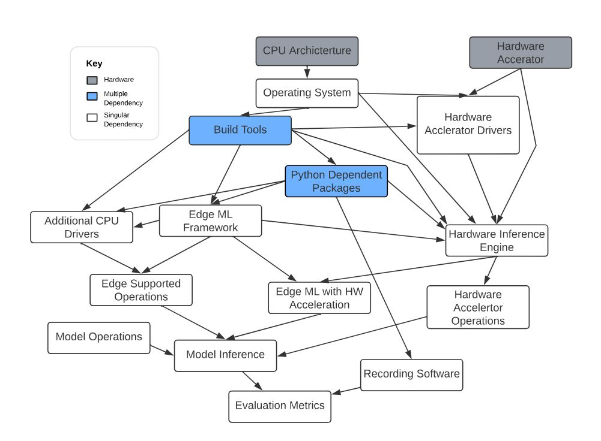
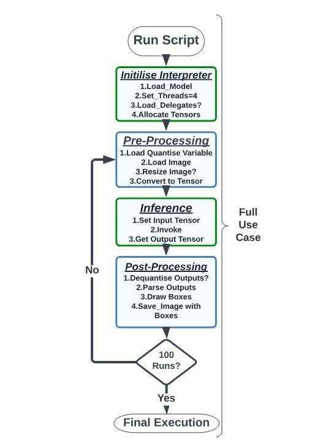

# 🚀 Towards On-Orbit Machine Learning in Picosatellites-WIP

The current method of downlinking the data collected by satellites to Earth causes high latency and power consumption and therefore is unsuitable for Picosatellites with limited system resources. On-Orbit Machine Learning (on-orbit ML) offers a solution by decreasing the amount of data to transmit. However, while ML methods exist for use in Picosatellites, they lack suitable recordings of system measurements such as power, memory, and processing time, which hinders their implementation. We address this issue by testing various ML models with compression methods and lightweight architectures on edge setups, using a mix of hardware and software optimisations, while focusing on different processing architectures, accelerators, and delegate improvements. We found that different combinations of models and edge setups for various goals and limitations that Picosatellites can have, providing valuable insights for practical applications. 
 
 
<p align="center">
  
  <br>
  <b>Figure:</b> Left – challenges with traditional satellite data collection; Right – benefits of On-Orbit processing using edge ML.
</p>
Key Features

-  Evaluates Object Detection models on constrained edge devices in the context of a a full deployment for example data reading, model image slicing .
-  Hardware and Software Optimisation **quantisation (INT8, FP16)** and hardware acceleration (TPU, GPU, etc.).
-  Software for automating the testing process on edge devices, including cv2 image processing and NMS for variety of models and quantisations. 
-  Framework for recording important information, complete breakdown of OS, Architectures and Software Packages.
-  Testbench
--
---

## 📁 Project Structure

```bash
.
├── models/             # YOLOv5 & YOLOv8 trained models
├── data/               # DIOR dataset preprocessing and conversion
├── scripts/            # Training, quantisation, benchmarking
├── results/            # Logged metrics and plots
├── docs/               # Full technical documentation
├── README.md
└── LICENSE
```

## 📁 Setting up edge boards
<p align="center">
  
  <br>
  <b>Figure:</b> How to setup a board
</p>
Each edge board introduces its own constraints. These diagrams highlight how hardware, accelerators, software packages, and progmraming languages environments interconnect. Use this as a guide to avoid common pitfalls when debugging or porting across devices.

<p align="center">
  
  <br>
  <b>Figure:</b> How to setup a board
</p>
This shows a strategy of setting up the boards detailing the common steps needed and where you might also find the solutions for them.

### 🧪 Setup used in this project

<p align="center">
  
  <br>
  <b>Figure:</b> Left – challenges with traditional satellite data collection; Right – benefits of On-Orbit processing using edge ML.
</p>

The following embedded devices were used to evaluate on-orbit ML performance:

**Raspberry Pi 3B+** — with Coral Edge TPU  
**Odroid N2+** — with ARM Mali-G52 GPU acceleration  
**Odroid XU4** — CPU-only testing

## 📁 Setting up test bench
You will need the odroid smart power 3 for real time data logging, however other 

Depending on what operating system your edge board is running the filepaths can be read in diffrently, because of this it should be best to set all the absolute file paths in x file, 

To record power effectively you will need a second device, to run the reciver code which will start the recording 
simply run the files after this 

### Metrics Measured

- 🔋 Peak Power at inferance and full process (mW)
- 💾 Memory usage (MB)
- ⏱️ Inference and Full Process time (s)
- 🎯 Accuracy (mAP50, Recall)


<p align="center">
  
  <br>
  <b>Figure:</b> Left – challenges with traditional satellite data collection; Right – benefits of On-Orbit processing using edge ML.
</p>

